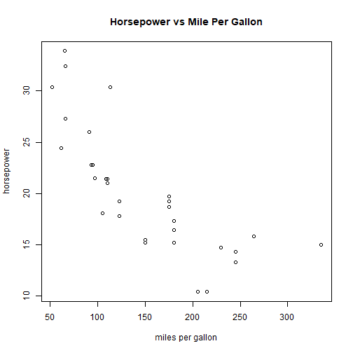

Cars Data
========================================================
author: David Nadler
date: March 22, 2021
autosize: true

Introduction
========================================================

The following was created in RStudio Presenter and published to Rpubs. 
It takes the **mtcars** dataset and plots the following variables:

- mpg (miles per gallon)
- hp (horsepower)

We should expect to see a negative correlation between the two variables since higher horsepower engines tend to have a lower fuel economy than lower horsepower engines.


Slide With Code
========================================================
Here we display how RStudio Presenter is able to compile code into an output.
As an example, we present the structure of this dataset.

```r
str(mtcars)
```

```
'data.frame':	32 obs. of  11 variables:
 $ mpg : num  21 21 22.8 21.4 18.7 18.1 14.3 24.4 22.8 19.2 ...
 $ cyl : num  6 6 4 6 8 6 8 4 4 6 ...
 $ disp: num  160 160 108 258 360 ...
 $ hp  : num  110 110 93 110 175 105 245 62 95 123 ...
 $ drat: num  3.9 3.9 3.85 3.08 3.15 2.76 3.21 3.69 3.92 3.92 ...
 $ wt  : num  2.62 2.88 2.32 3.21 3.44 ...
 $ qsec: num  16.5 17 18.6 19.4 17 ...
 $ vs  : num  0 0 1 1 0 1 0 1 1 1 ...
 $ am  : num  1 1 1 0 0 0 0 0 0 0 ...
 $ gear: num  4 4 4 3 3 3 3 4 4 4 ...
 $ carb: num  4 4 1 1 2 1 4 2 2 4 ...
```

Slide With Plot
========================================================
We plotted the horsepower versus miles per gallon here and confirm the negative correlation.


Thank You
=========
